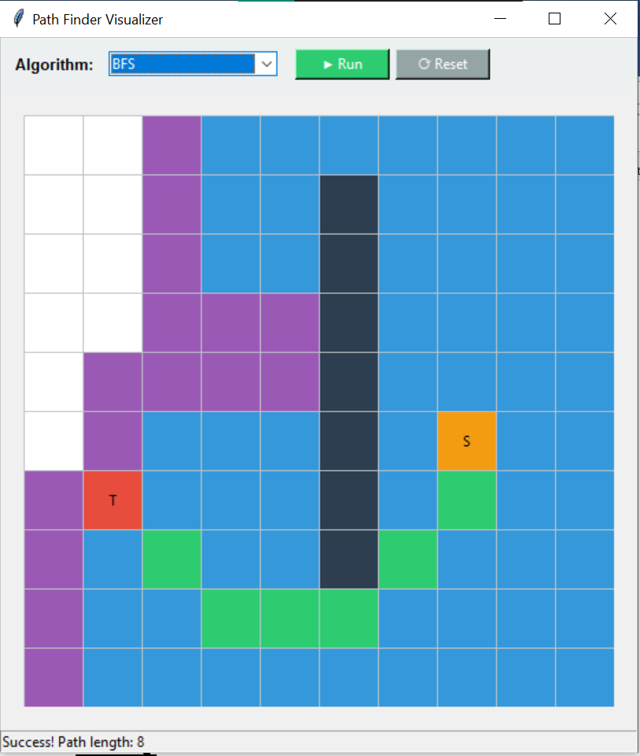

# Pathfinding Algorithm Visualizer 🚀


A Python-based GUI application built with `Tkinter` that visualizes how various search algorithms find their way from a start point (S) to a target (T) on a grid.


## ✨ Features
* **Visual Representation:** Watch the "Frontier" and "Visited" nodes expand in real-time.
* **Multiple Algorithms:**
  * **BFS** (Breadth-First Search) - Finds the shortest path.
  * **DFS** (Depth-First Search) - Explores deep before wide.
  * **UCS** (Uniform Cost Search) - Dijkstra's simplified.
  * **IDDFS** (Iterative Deepening DFS) - Combines DFS depth with BFS optimality.
  * **Bidirectional Search** - Searches from both ends simultaneously.
* **Interactive UI:** Smooth control panel to reset and run different algorithms.

## 🛠️ Installation
1. Clone the repo:
   ```bash
   git clone https://github.com/abeerashraf1405/Pathfinding-Visualizer-Python.git
   

2. Ensure you have Python installed (3.x).
Run the application:
```bash
python pathfinder.py
``` 

## 👨‍💻 Author
Abeer
Computer Science Student at FAST University.

Interested in AI, Algorithms, and System Design.

## 📜 License
This project is for educational purposes. If you use this code, please attribute the original author (Abeer).

## 5. Pro-Tip for Credit (The License)
If you really want to protect your work, add a `LICENSE` file:
1.  Click **Add file** -> **Create new file**.
2.  Name it `LICENSE`.
3.  Click **Choose a license template**.
4.  Select **MIT License** (standard) or **GNU GPLv3** (stricter).
5.  It will automatically insert your name and the year.
